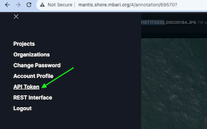

[](http://www.mbari.org)
[](https://github.com/semantic-release/semantic-release)
[](https://opensource.org/licenses/Apache-2.0)
[](https://www.python.org/downloads/)

**fastapi-tator** A RESTful API for bulk operations on a Tator database on clustered, labeled, localization data.
It uses the Python web framework [FastAPI](https://fastapi.tiangolo.com/). 

This accelerates machine learning workflows that use clustered, labeled, localization data

It is currently live at http://mantis.shore.mbari.org:8001/docs.

Features
-  Get a list of all unique labels for a given project
-  Change a localization label in a given [sdcat](https://github.com/mbari-org/sdcat) generated cluster by query criteria, e.g. media (partial) name, model version
-  Delete localizations with low saliency scores in a given project
-  Report how many localizations for a given project are flagged for deletion
-  Delete all localizations flagged for deletion in a given project
-  Change a localization label for a particular database id

--- 

---

# Requirements

For deployment, you will need:
- [Docker](https://docs.docker.com/get-docker/)
- [Docker Compose](https://docs.docker.com/compose/install/)

For development, you will need:
- [Python >=3.12](https://www.python.org/downloads/)
- [Anaconda](https://www.anaconda.com/)
- [Docker](https://docs.docker.com/get-docker/)
- [Docker Compose](https://docs.docker.com/compose/install/)
- [Tator](http://github.com/mbari-org/tator)

# Deployment

## Clone the repository and run the docker compose file

```shell
git clone --recurse-submodules https://github.com/mbari-org/fastapi-tator
cd fastapi-tator
cp example-env .env
make tator
make superuser
```

## Fetch your API key for Tator

Create an API token for a user with full admin and set that in the .env file
along with the Tator server URL.

```shell
echo "TATOR_API_HOST=http://localhost" > .env
echo "TATOR_API_TOKEN=15a0f486cde0f09329b09f3274de1b962c2273a4" >> .env
```



## Build and start the docker containers

```shell
./bin/docker_build.sh
./bin/run_prod.sh
```
Optionally, set the environment variable `TATOR_DEFAULT_PROJECT` to the value of the project you would like to default to.
```shell
export TATOR_DEFAULT_PROJECT="901103-biodiversity"
```

Your server is now running at `http://localhost:8000/docs`

## Try it out

Open the browser to http://localhost:8000/docs to see the API documentation.

### Health Check
Check the health of the server by going to `http://localhost:8000/health`.  You should see the following response:

```json
{"status":"ok"}
```

## Related work
 
* https://github.com/mbari-org/sdcat [Sliced Detection and Clustering Analysis Toolkit]